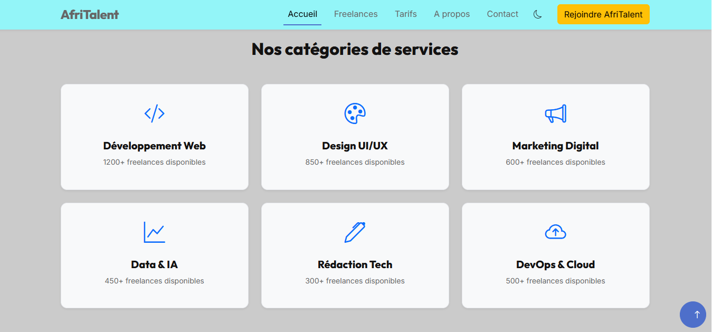
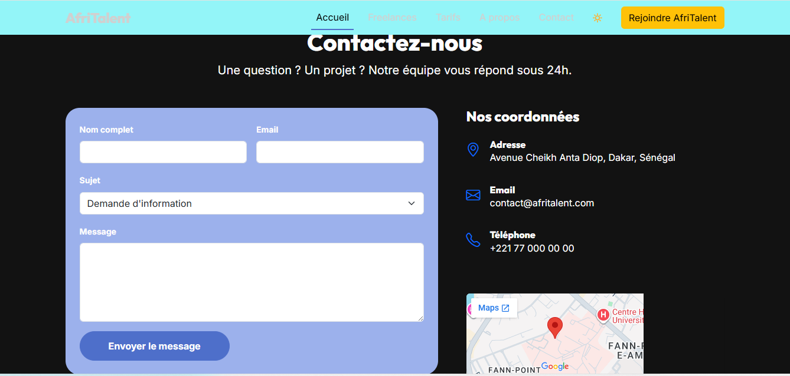

## Nom du projet
AfriTalent

---

# AfriTalent
Projet fil rouge - Plateforme de mise en relation entre freelances africains et clients.
Auteuere : Mada Coly
Promotion : L2 IAGE - ISI

---

## Description du projet

AfriTalent est une plateforme web conçue pour mettre en relation des talents africains (freelances, développeurs, designers, etc.) avec des startups et entreprises à la recherche de compétences.  
Le site permet de présenter des profils de freelances, de consulter des services et de faciliter la prise de contact.  
Il a été développé dans un objectif pédagogique afin de mettre en pratique les compétences en développement web frontend.

---

## Technologies utilisées

- HTML5  
- CSS3 (Flexbox, Grid, variables CSS, mode sombre)  
- JavaScript (interactions dynamiques)  
- Bootstrap 5 (mise en page responsive)  
- Git & GitHub (versioning)  
- GitHub Pages (déploiement)

---

## Fonctionnalités principales

- Mode clair / mode sombre
- Interface responsive (mobile, tablette, desktop)
- Affichage de cartes de freelances et services
- Formulaire de contact interactif
- Navigation fluide entre les pages
- Design moderne avec effets hover et transitions CSS
- Organisation en sections claires (accueil, services, contact)

---

## Capture d’écran





---

## Instructions pour lancer le projet en local

1. Télécharger ou cloner le dépôt :
```bash
git clone https://github.com/ton-utilisateur/AfriTalent.git

2. Ouvrir le dossier du projet
3. Lancer le fichier index.html dans un navigateur :
    * Double-clic sur index.html
    * ou utiliser Live Server sur VS Code
```


---
## Ressources consultées

* Documentation officielle HTML : https://developer.mozilla.org/fr/docs/Web/HTML
* Documentation CSS : https://developer.mozilla.org/fr/docs/Web/CSS
* Bootstrap 5 : https://getbootstrap.com/docs/5.3/
* JavaScript MDN : https://developer.mozilla.org/fr/docs/Web/JavaScript
* GitHub Docs : https://docs.github.com/
* GitHub Pages : https://pages.github.com/

